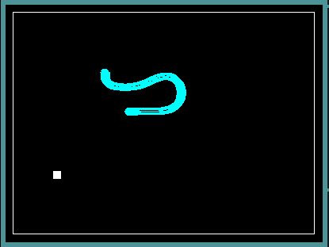

# Snake
A rather rudimentary game with a rather rudimentary twist

 
# Setting Up Camp:
  ## By Hand:
  compile ssw
  
  `gcc -c ssw.c -o ssw.o -lX11`

  compile bezier.c
  
  `gcc -c bezier.c -o bezier.o`

  and last but not least:
  
  `gcc ssw.o bezier.o snake.c -o snake -lX11`

  ## Install Script:
  `chmod +x deploy && ./deploy`
  
# Enjoying:
There area few known bugs:

Severe lag loading in bezier curves over 20 points long

The snake isn't exactly *supposed* to have a mouth

There are probably more I'm forgetting

# What's Inside?
Not caramel/nougat/chocolates

A large portion of the code is my own spare the: 

## FISR() function
I stolen this from Quake III source code, but found a better magic constant

## drawcurve():
Something out of a ongoing project of mine that I thought could be adapted here

